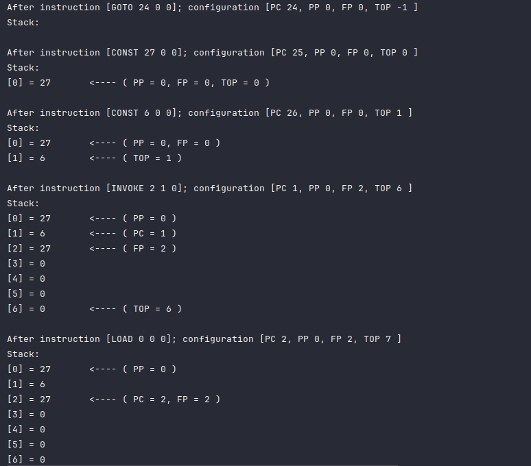

# UAP - Projekt 1

Das Projekt enthält ein Maven-Buildscript zum Bauen der JAR-Datei (tram.jar) und zum Auflösen der Abhängigkeiten (Log4J).
Mit folgendem Befehlt das kann Buildscript ausgeführt werden:
```bash
git clone "https://github.com/s4pideam/UAP.git"
cd UAP
mvn clean package
```

Das Programm kann über die Konsole wie folgte ausgeführt werden (hier beispielhaft aus dem Hauptordner des Projekts):
```console
java -jar ./target/tram.jar ./tramcode/ggt.tram  -console
```

Als Paramter stehen zur Auswahl:

**-stepwise** : Step by step Ausführung des Programms. Der nächste Schritt wird erst ausgeführt, wenn der Nutzer die Eingabetaste drückt.

**- console** : Debugging Ausgabe auf der Konsole.

**- file** : Debugging Ausgabe in einer Datei (Debug.log).

**- detailed** Detaillierte Ansicht vom Debugging

## Beispielausgabe


